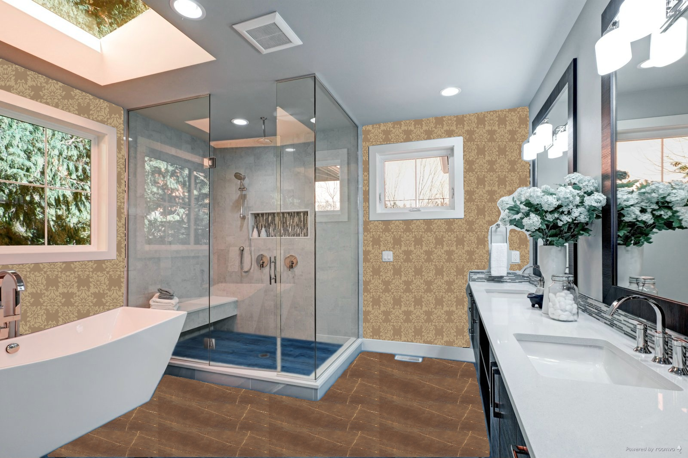

# Indoor Scene Layout Estimation and Floor-Wall Rendering Engine

A comprehensive computer vision solution for estimating interior room layout from a single image and rendering floors and walls with custom product overlays. This system enables virtual visualization of interior design products in real-world settings.

## 🔍 Overview

This system provides an end-to-end pipeline for:
1. Estimating the 3D layout of interior spaces from a single image
2. Segmenting walls and floors using state-of-the-art computer vision models
3. Extracting key points for perspective-correct overlay of design products
4. Blending products with realistic lighting to match the scene illumination

## 🏗️ Architecture

The repository contains three core modules:

### 1. Spatial Layout Estimation

Leverages the LSUN-Room layout estimation model to generate layout maps from input source images. This module:
- Processes a single image to detect room corners and boundaries
- Generates a layout segmentation map
- Creates layout matrix files with structural information

### 2. Overlay Engine

Transforms product images (flooring, wall coverings, etc.) to match the perspective of the target surface:
- Uses layout images, product images, and segmented masks
- Extracts key points from layout images and matrices 
- Applies perspective transformations for realistic product placement
- Handles various room layouts (2-corner, 4-corner configurations)

### 3. Illumination Adjustment

Enhances realism by preserving the original scene lighting conditions:
- Extracts shadows and lighting information from source images
- Applies lighting adjustments to transformed product overlays
- Blends the final result for natural appearance

## 🚀 Usage

### Setup
```bash
# Clone the repository
git clone https://github.com/username/mfs.git
cd mfs

# Install dependencies
pip install -r requirements.txt
```

### Layout Estimation
```python
from layout_estimator.demo_lsun import process_layout

# Generate layout map and matrix
process_layout('path/to/source_image.jpg', 'layout_output/')
```

### Product Overlay
```python
from final_client_version.mask_blender import MaskBlender

# Initialize blender with directories
blender = MaskBlender(
    layout_dir='path/to/layout_outputs', 
    src_img_dir='path/to/src_img',
    masks_dir='path/to/masks',
    products_dir='path/to/products'
)

# Apply product overlay at specific coordinate
result = blender.implant_overlay((x, y), 'product_image.jpg')
```

## 🛠️ Dependencies

- Python 3.6+
- PyTorch 1.0+
- OpenCV
- NumPy
- Matplotlib
- PIL

## 💡 Example

Input Room Image → Layout Estimation → Product Selection → Final Rendering

<!--  -->

<div style="display: flex; justify-content: space-around; align-items: center;">
  <div style="text-align: center;">
    
    <p><b>Input Room Image</b></p>
  </div>
  <div style="text-align: center;">
    
    <p><b>Final Rendering</b></p>
  </div>
</div>


## 🙏 Acknowledgements

This project implements methods inspired by research in the field of indoor scene understanding and perspective geometry:
- LSUN Room layout estimation challenge
- Perspective transformation techniques
- Image blending and illumination transfer research
